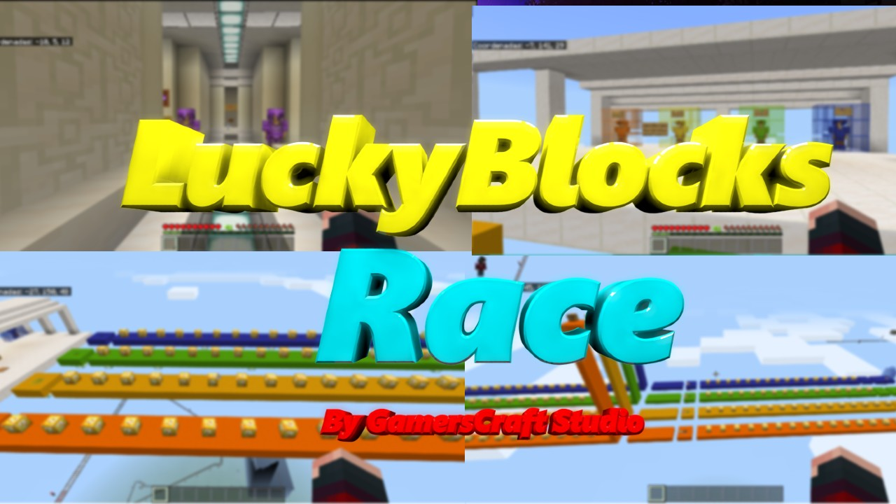
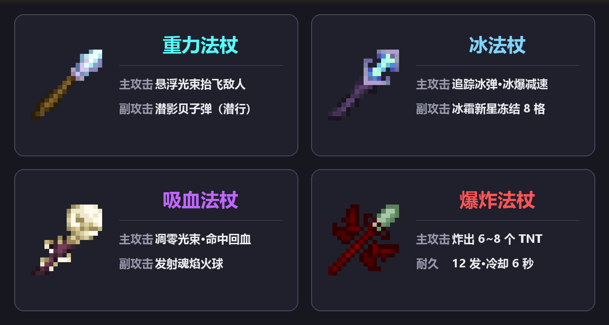
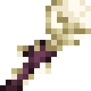
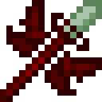
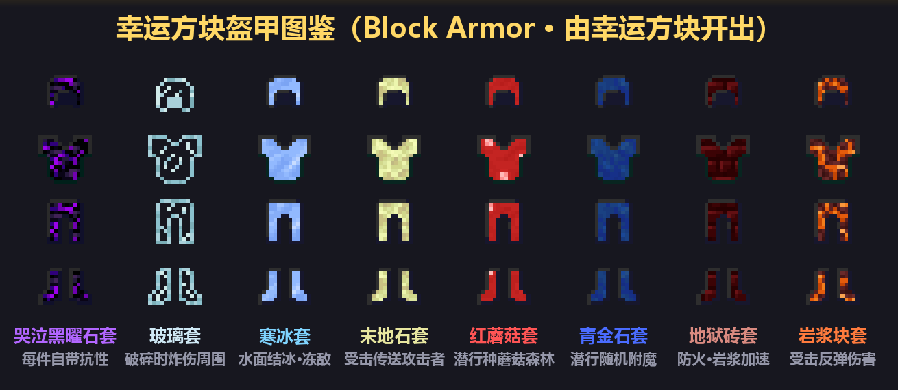
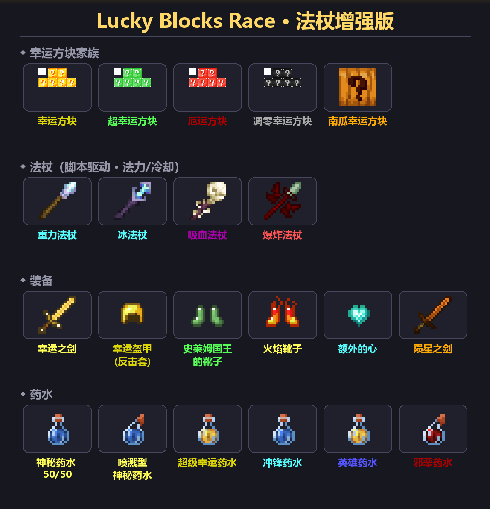

<div align="center">



# 🎲 幸运方块竞速 · 法杖增强版 🏟️

**Lucky Blocks Race — Staff Enhanced + Colosseum**

在经典基岩版幸运方块竞速地图上深度二改：**4 根原创法杖 · 20+ 套方块盔甲 · 281 种随机事件 · 红黄蓝绿四人赛道 · 罗马斗兽场终极对决**


[⬇️ 安装](#️-安装与进入地图) · [🕹️ 玩法](#-怎么玩) · [🪄 法杖图鉴](#-四根原创法杖) · [🛡️ 盔甲图鉴](#️-方块盔甲图鉴) · [📊 概率统计](docs/幸运方块概率统计.md)

</div>

---

## 🗺️ 这是一个什么地图？

原版 [Lucky Blocks Race v1.7](https://plasmaspacestudios.com)（PlasmaSpace Studios 出品）的玩法：**沿四色赛道狂奔，边跑边挖幸运方块，靠运气拿到神装/被坑到怀疑人生，最先冲线的人赢。**

本仓库在此基础上做了大幅增强，原版玩法全部保留，另加了：

- 🪄 **四根原创法杖** —— 重力 / 冰 / 吸血 / 爆炸，自带法力与冷却系统
- 🛡️ **20+ 套方块盔甲** —— 哭泣黑曜石、寒冰、玻璃、末地石、蘑菇……每套都有专属特效
- 🎲 **随机事件大改** —— 普通幸运方块就有 **281 种**分支，外加「雷暴+凋零」全图级灾难事件
- 🧪 **神秘药水 50/50** —— 喝之前先想想自己今天的运气
- 🏁 **红黄蓝绿四条赛道** —— 最多 4 人同场竞速
- 🏟️ **罗马斗兽场** —— 终点之外，用法杖来一场了断

## 🕹️ 怎么玩？

1. **竞速**：1~4 人各选一条赛道（红/黄/蓝/绿），一路挖开挡路的幸运方块——开出啥全看命，装备越怪跑得越颠。
2. **冲线**：踩上终点线的压力板，直接传送到斗兽场。
3. **斗兽场决战**：把竞速途中攒下的法杖、盔甲、药水全部带上，在斗兽场里打到最后一人站着。

> ⚠️ 斗兽场**不是开局就有**的：第一次进入世界后，站到坐标 **(300, 5, 300)** 附近，**开启作弊**，按顺序执行下面 5 条命令，10 秒钟建好一座斗兽场：
>
> ```
> /function colosseum/01_prepare
> /function colosseum/02_shell
> /function colosseum/03_arches
> /function colosseum/04_detail
> /function colosseum/05_finish
> ```

## 🪄 四根原创法杖



所有法杖共用一套**法力系统**：法力 = 物品耐久条，主攻击长按使用键释放，副攻击**潜行 + 点击**，统一 6 秒冷却，法力耗尽时动作栏会提示。

###  重力法杖

- **主攻击 · 悬浮光束**：光束扫中的敌人会被抬上天空（悬浮 5.5 秒）并受到伤害——把追逐者晾在半空，跑路神器
- **副攻击**：发射一颗潜影贝子弹，跟踪追击
- 光束射程 20 格、140° 扇形，贴脸 5 格内免瞄准

###  冰法杖

- **主攻击 · 追踪冰弹**：发射会拐弯的冰球（12 格自动锁定、弱追踪），命中冰爆——**不破坏地形**，并大幅减速敌人
- **副攻击 · 冰霜新星**：以自身为中心冻结周围 8 格，敌人缓慢 + 挖掘疲劳 + 直伤
- 冰球带缓降弹道，抛物线越过障碍物照样咬人

###  吸血法杖

- **主攻击 · 凋零光束**：暗影光束重创敌人（凋零 + 直伤），只要命中就给自己回血
- **副攻击**：发射魂焰火球，远距离收割
- 打得越准站得越久，竞技场持久战之王

###  爆炸法杖

- **主攻击 · 炸弹球**：投出一颗沿视线飞行的炸弹球，撞停即炸——原地落下一圈 **6~8 个 TNT**（引信 1~2 秒，跑！）
- 仅 **12 发**耐久的重火力，每发都是一次小型空袭
- 法杖掉率与陨星之剑同级，开出即是天选

> 调参党看这里：所有法杖的数值（伤害/法力/冷却/追踪强度）都集中在
> `behavior_packs/LuckyBlock/scripts/staffs.js` 顶部的常量区，注释写清了每一条的机理。

## 🛡️ 方块盔甲图鉴

幸运方块会开出 **20 多种「方块盔甲」**（Block Armor）——把方块穿在身上，每套都有专属特效：



| 套装 | 特效 |
|---|---|
| 🟣 **哭泣黑曜石套** | 每件自带**抗性提升**；胸甲护腿沉重（缓慢）——坦克的浪漫 |
| 🧊 **寒冰套** | 全套可**在水面上结冰行走**；受击有概率**冻结攻击者**（每件 +15% 概率） |
| 🥃 **玻璃套** | 玻璃易碎：任何一件被打碎时**炸伤周围敌人**（10 点伤害 + 缓慢 + 虚弱） |
| 🟡 **末地石套** | 受击把攻击者**随机传送走**——敌人追着追着就迷路了 |
| 🍄 **红蘑菇套** | 全套潜行释放**「蘑菇森林」**：面前瞬间长出 10 棵巨型蘑菇（20 秒冷却） |
| 🔵 **青金石套** | 挖矿掉经验球；全套**潜行 1.5 秒花 10 级经验随机附魔**手上物品——**附魔等级可超过原版上限**（锋利 VI 不是梦） |
| 🧱 **地狱砖套** | 免疫火焰；泡在岩浆里还能加速——岩浆池当泳道 |
| 🔥 **岩浆块套** | 受击把伤害**反弹**给攻击者 |
| 🌵 仙人掌套 | 受击反伤（每件 5 点），盔甲还会自动修复 |
| ✨ 萤石套 | 每件自带**动态光源**，黑夜探险不用火把 |
| 🌊 海晶套 | 每件给**潮涌能量**：水下呼吸 + 水下夜视 |
| 🟢 史莱姆套 | 每件**跳跃提升** |
| ⚫ 煤炭套 | 随身「烤炉」，把生肉就地烤熟 |
| 🐑 羊毛套 | 夜晚穿上直接**入睡跳到白天** |
| 🪨 石头系（石/安山岩/闪长岩/花岗岩） | 胸甲沉重（缓慢），但便宜耐撞 |

> 还有幸运**专属套装**：**幸运盔甲**四件套（护甲值对标钻石）——穿齐全套每 10 秒随机一个 II 级增益（速度/急迫/再生/吸收/力量等 14 种），**别人打你还会吃你一身负面效果**（凋零/饥饿/漂浮/失明……同一敌人 2 秒内只结算一次）。

## 🧪 药水与神器

- 🧪 **超级神秘药水（50/50）**：喝下后一半概率强力增益、一半概率自求多福。敢不敢喝？
- 💙 **额外的心**：吃一颗攒一颗，最多累计 20 颗——死亡清零，且行且珍惜
- 🗡️ **幸运之剑 / 陨星之剑 / 钻石英之棍** 等特殊武器
- 👑 **史莱姆国王的靴子**（跳跃提升 IV）、**火焰靴子**（护甲值 4，比钻石靴子还高 1 点）
- ✨ 以及一大堆幸运药水：超级幸运药水、英雄药水、冲锋药水、邪恶药水……



## 🎲 幸运方块家族

地图里有 **12 种**幸运方块：普通 / 超幸运 / 厄运 / 凋零幸运 / 南瓜限定款，以及幸运泉、幸运生物、幸运掉落、幸运建筑、幸运 PvP 等特殊款。

- 普通幸运方块一挖就有 **281 种分支**（0.36% × 281）：金苹果雨、鞘翅、刷怪笼、幸运监狱、彩色跑酷、幽灵骑士、僵尸巨人……
- 单根法杖的边际掉率约 **0.17~0.18%**，整套「法杖捆」约 2.14% —— 法杖是真的稀有
- 想知道每一条分支的概率？[**docs/幸运方块概率统计.md**](docs/幸运方块概率统计.md) 里有全量拆解（3200 行静态分析，逐分支概率表）

**招牌灾难事件「雷暴 + 临时凋零」**：触发瞬间全图玩家获得弓 + 64 支箭 + 2 分钟抗性提升，随后 10 秒内 15 格范围连劈雷暴（每秒 4~8 道），同时召唤一只 2 分钟后自动消失的凋零——多人局里最难忘的 12 秒。

## ⬇️ 安装与进入地图

**版本要求：Minecraft 基岩版 1.21+（实测 1.21.113）**，Windows / Android / iOS 均可。

- **方式 A（推荐）**：到 [Releases](../../releases) 下载 `LuckyBlocksRace_StaffEnhanced_Colosseum_v1.0.mcworld`，双击（手机端「打开方式 → Minecraft」）即可自动导入。
- **方式 B**：`Code → Download ZIP` 下载本仓库，把解压出的文件夹整个放进 `com.mojang/minecraftWorlds/`，重启游戏后在世界列表里找「Lucky Blocks Race」。
- **联机**：主机玩家可通过 Realms 游玩；Windows/手机可局域网联机，最多 4 人。
- 建斗兽场等管理指令需要**开启作弊**（会关闭成就），正常跑图挖方块不需要。

## 🛠️ 管理员指令（需开作弊）

| 指令 | 作用 |
|---|---|
| `/function give` | 一键获得 8 种幸运方块各 64 个 |
| `/function colosseum/01_prepare` ~ `05_finish` | 在 (300, 5, 300) 分步建造斗兽场 |
| `/function track/00_setup` ~ `08_entrance` | 分步重建赛道（误删可用） |

## 🙏 署名与致谢

| 内容 | 作者 |
|---|---|
| 原版地图 **Lucky Blocks Race v1.7** | [PlasmaSpace Studios](https://plasmaspacestudios.com)（[@PlasmaSpaceStud](https://twitter.com/PlasmaSpaceStud)） |
| **Lucky Blocks Add-On V4**（幸运方块核心） | Effect99 |
| **Block Armor V2.1.6**（方块盔甲） | SystemTv |
| **Piano plus**（钢琴音源） | SHT落泪（音源：晚霞黯然） |
| 法杖系统、随机事件增强、赛道与斗兽场 | 本仓库作者 |

## ⚖️ 版权与免责声明

- 本仓库是**非官方粉丝二改作品**，与 Mojang / Microsoft 无关。
- 原版地图与各 Add-On 的版权归原作者所有；本仓库中**新增/修改的脚本、文档与建造函数**部分以 [CC BY-NC-SA 4.0](https://creativecommons.org/licenses/by-nc-sa/4.0/deed.zh) 提供。
- 仅供学习交流，**禁止商用**；如权利人认为内容侵权，请提 Issue，核实后会第一时间下架处理。

---

## 🌏 English (TL;DR)

A heavily-modified **Bedrock Edition Lucky Blocks Race** map (based on Lucky Blocks Race v1.7 by PlasmaSpace Studios): 4 custom **staffs** (Gravity / Ice / Lifesteal / Explosion) with a mana & cooldown system, **20+ Block Armor sets** with unique perks (freeze attackers, water-walking on ice, random super enchanting, mushroom forests…), **281 random outcomes** per lucky block (plus a thunderstorm + temp-Wither event), a **4-lane red/yellow/blue/green race track** for up to 4 players, and a **Roman Colosseum** for the final PvP showdown — built in-game with 5 `/function` commands at (300, 5, 300).

**Install**: grab the `.mcworld` from [Releases](../../releases) and open it with Minecraft (Bedrock **1.21+**, tested on 1.21.113), or drop the repo folder into `com.mojang/minecraftWorlds/`.

All original content belongs to its authors (PlasmaSpace Studios, Effect99, SystemTv, SHT落泪). Fan-made, non-commercial, no infringement intended — open an issue and it will be taken down promptly.

---

<div align="center">

**祝你好运 ;D** —— Just enjoy and good luck, 来自 PlasmaSpace Studios 的祝福

</div>
